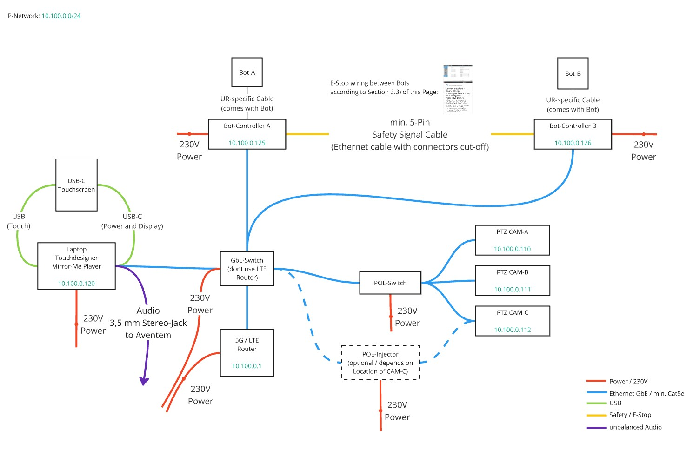

# MirrorMeBot
Mirror Me Installation

# Bot-Setup
- Safety Password: ***
- Payload:
  - 12.3 kg
  - COG CZ: 25mm
  - Custom inertia Matrix:
    - x-x: 16.4
    - x-y: 16
    - z-z: 8.4
- copy mirror-me-player/bot_programs/mirror-me.urp to program folder of bot
- set Bot to Remote Control Mode

## VNC Setup
- SSH into Bot as root default pass is ***
- uncomment all sources in /etc/apt/sources.list
- apt-get update
- apt-get install x11vnc
- apt-get install screen
- nano /etc/rc.local -> add screen -dmS vnc x11vnc -forever -passwd YOURPASSWORD -shared

## URSim Virtual Box
For testing a virtual Bot can be used that runs in a virtual machine: [Download - UR Account needed](https://www.universal-robots.com/download/software-e-series/simulator-non-linux/offline-simulator-e-series-ur-sim-for-non-linux-5126-lts/)

# Network
Network performance between the PC running Mirror-Me Player and the Bots is extremely important. The Bots and the Laptop should be connected by a Gigabit-Switch. Please do not use LTE-Routers or similar devices with integrated switches for connecting the Bots to the PC.

- IP-Network: 10.100.0.0/24
- 4G Router IP: 10.100.0.1
- Laptop: 10.100.0.120
- Bot A: 10.100.0.125
- Bot B: 10.100.0.126
- Cam A: 10.100.0.110
- Cam B: 10.100.0.111
- Cam C: 10.100.0.111

# Component Connections / cabeling
